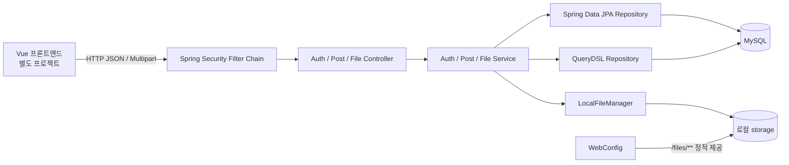
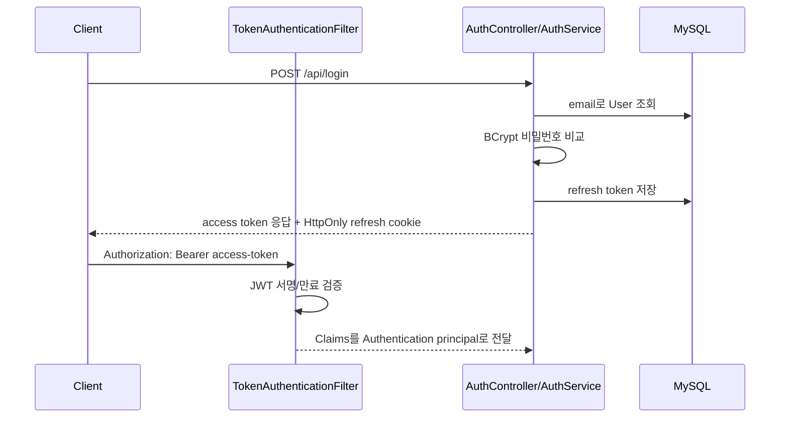
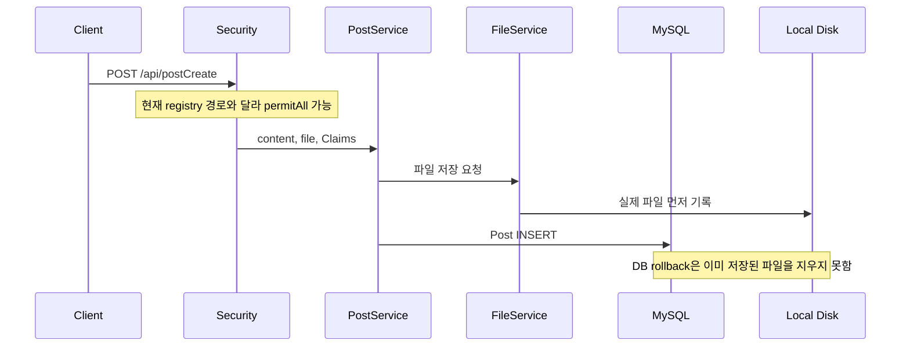

# 검수 방법과 현재 아키텍처

## 1. 검수 페르소나

이번 검수는 한 가지 관점에서 결론을 먼저 정한 뒤 근거를 끼워 맞추지 않도록, 같은 코드를 다음 네 관점으로 반복 확인했습니다. 이는 여러 사람이 실제로 검수했다는 뜻이 아니라, **검수 질문과 판정 기준을 의도적으로 분리한 인지적 리뷰 방식**입니다.

### 운영 장애 감사자

- 서버가 재시작되거나 운영 프로필이 켜졌을 때 데이터가 보존되는가?
- 개발 PC 경로·비밀번호·포트가 운영 환경에 새어 들어가지 않는가?
- 환경 변수가 누락되거나 오타가 있을 때 조용히 잘못 동작하지 않는가?

### 백엔드 장애 분석가

- 정상 입력뿐 아니라 null, 빈 값, 긴 값, 동시 요청, 존재하지 않는 경로에서 어떤 예외가 나는가?
- 그 예외가 의도한 HTTP 상태와 응답 코드로 변환되는가?
- 트랜잭션이 DB와 파일 시스템을 함께 되돌릴 수 있다고 잘못 가정하지 않았는가?

### 아키텍처 리뷰어

- Controller → Service → Repository의 책임이 일치하는가?
- 실제 URL, Security URL, 문서 URL, 파일 URL이 같은 계약을 가리키는가?
- JPA 지연 로딩, 트랜잭션, OSIV 사이에 숨은 의존성이 없는가?

### 공격자 관점 보안 검토자

- 인증 없는 사용자가 호출할 수 있는 API는 무엇인가?
- 공격자가 업로드, JWT, 예외 메시지, Swagger, 로그를 어떻게 악용할 수 있는가?
- 정상적인 UI 흐름이 아니라 HTTP 요청을 직접 만들어도 방어되는가?

## 2. 동조편향을 줄인 판정 절차

각 이슈는 다음 순서로 판단했습니다.

1. **가설 작성:** 예: “게시글 작성 API가 인증 없이 열릴 수 있다.”
2. **독립 근거 확인:** 컨트롤러의 실제 매핑과 Security registry를 각각 확인합니다.
3. **반증 시도:** 동일 경로를 보호하는 `@PreAuthorize`, 다른 필터 체인 등이 있는지 찾습니다.
4. **영향 분리:** 반드시 발생하는 오류와 특정 배포 환경에서만 발생하는 위험을 구분합니다.
5. **심각도 결정:** 코드 모양이 아니라 데이터·권한·가용성에 미치는 영향으로 등급을 정합니다.

문서의 표현은 다음 기준을 사용합니다.

- **확정:** 현재 코드만으로 불일치 또는 잘못된 설정을 확인할 수 있음
- **재현 확인:** 현재 실행 중인 로컬 서버에서 읽기 전용 호출로 증상을 확인함
- **조건부 위험:** 배포 OS, 프록시, 브라우저 origin 등에 따라 발생 여부가 달라짐

## 3. 현재 프로젝트 구조

현재 이름에 `msa`가 들어가지만 배포 단위와 DB는 하나인 **모듈형 모놀리스에 가까운 구조**입니다. 이것 자체는 나쁜 것이 아닙니다. 다만 로컬 파일 저장을 사용하기 때문에 인스턴스를 여러 대로 늘리면 각 서버가 서로 다른 파일을 갖게 됩니다. 진짜 분산 배포를 목표로 한다면 S3 호환 오브젝트 스토리지 같은 공유 저장소가 필요합니다.

## 4. 실제 요청 흐름

### 인증 요청

### 게시글 작성 요청

## 5. 구조상 잘된 부분

- 도메인 패키지가 `auth`, `post`, `user`, `file`로 나뉘어 탐색하기 쉽습니다.
- 비밀번호는 BCrypt로 비교하고 refresh token은 HttpOnly 쿠키로 전달합니다.
- 게시글 목록은 QueryDSL fetch join으로 작성자 조회의 N+1 문제를 피합니다.
- `@SQLDelete`, `@SQLRestriction`으로 게시글과 사용자 소프트 삭제 정책을 적용했습니다.
- 공통 응답 코드가 `CustomResponseCode` enum으로 모이기 시작했습니다.
- 필터에서 발생한 JWT 예외를 MVC 예외 처리기로 연결해 응답 형식을 통일하려는 방향은 좋습니다.

## 6. 구조상 핵심 개선 방향

- URL 문자열 배열 기반 블랙리스트 대신 “공개 API만 permitAll, 나머지는 authenticated” 정책을 사용합니다.
- API 경로를 REST 형태로 통일합니다: `POST /api/posts`, `DELETE /api/posts/{id}`.
- 조회 서비스에도 `@Transactional(readOnly = true)`를 명시하고 DTO 변환을 트랜잭션 안에서 끝냅니다.
- 파일 저장을 별도 저장소 인터페이스로 추상화하고 DB 실패 시 보상 삭제를 수행합니다.
- 중복된 User용 Repository와 사용하지 않는 DTO·서비스를 정리해 실제 연결 구조만 남깁니다.
