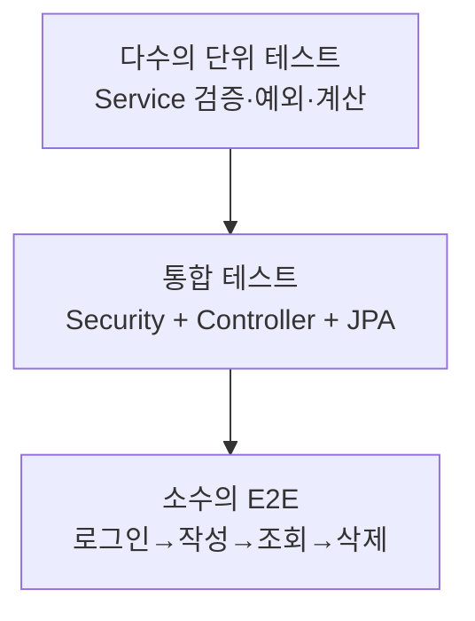

# 수정 우선순위와 테스트 로드맵

## 1. 권장 작업 순서

### Phase 0: 배포 차단 문제

#### 0-1. 데이터 초기화 격리

- 공통 `application.yaml`: `spring.sql.init.mode: never`
- `application-local.yaml`: 필요한 경우에만 `always`
- 운영 프로필에서 `never`를 다시 명시해 실수 방지
- 더미 SQL의 refresh token 제거
- Flyway/Liquibase로 schema version 관리 시작

**완료 조건**

- `prod` 프로필로 두 번 기동해도 기존 row 수와 내용이 바뀌지 않습니다.
- local/test 외 프로필에서는 dummy SQL 실행 로그가 없습니다.

#### 0-2. Security 정책과 URL 통일

- `POST /api/posts`
- `DELETE /api/posts/{id}`
- 공개 URL만 `permitAll`, 그 외 `authenticated`
- 파일 업로드는 인증 필요

**완료 조건**

- 토큰 없는 작성·삭제·업로드는 401입니다.
- 잘못된/만료된 토큰은 E04입니다.
- 본인이 아닌 게시글 삭제는 403입니다.

### Phase 1: 운영 설정과 보안

#### 1-1. 프로필 설정 정리

- `${DB_PROT}` → `${DB_PORT}`
- DB/JWT secret 기본값 제거
- `FILE_STORAGE_PATH`, `SERVER_URI`, `CORS_ALLOWED_ORIGINS` 의미 정리
- 운영 `Secure=true`, stack trace/message 비공개
- 운영 Swagger 비활성화 또는 접근 제한
- `spring.jpa.open-in-view=false`
- 사용하지 않는 MyBatis/Spring AI 설정 제거

#### 1-2. JWT 강화

- `token_use` 또는 audience로 access/refresh 구분
- issuer, audience, token_use 검증
- refresh token hash 저장
- null 저장 토큰 명시 처리
- `ResponseCookie`로 SameSite 설정
- role을 GrantedAuthority에 매핑

#### 1-3. 파일 업로드 강화

- SVG 차단
- 실제 MIME/magic number 확인
- 이미지 decode 및 재인코딩
- 인증, 사용자별 quota, rate limit
- DB 실패 시 저장 파일 보상 삭제
- 임시 파일 정리 스케줄 또는 metadata table
- 운영에서는 object storage 검토

### Phase 2: API·예외 계약

- `PostDeleteException`을 403/E03에 연결
- 게시글 없음은 404/E10
- 사용자 입력 파일 형식 오류는 400 또는 415
- 중복 코드 `11`을 `E11`로 수정
- `NoResourceFoundException`을 404로 처리
- `DataIntegrityViolationException` 등 Spring Data 예외 처리
- 게시글 작성 응답을 201 + 생성 DTO 또는 명확한 Void로 변경
- field validation 오류를 `data`에 구조화
- `api-response-spec.md`를 현재 enum/handler 기준으로 다시 생성

### Phase 3: 구조 정리

- User Repository 중복 통합
- 빈 UserController/UserService 정리 또는 기능 구현
- 미사용 DTO와 `PostRepository.user()` 제거
- Entity 전체 setter 제거, 의미 있는 상태 변경 메서드 도입
- 조회 서비스에 `@Transactional(readOnly=true)`
- 상세 게시글도 User fetch join 또는 EntityGraph 사용
- limit 최대값과 overflow 방지
- 공개 작성자 DTO에서 email/role 제거

## 2. 최소 자동화 테스트 목록

현재 테스트는 `contextLoads()` 한 건뿐이므로 아래 순서로 추가하는 것이 효율적입니다.

### Security MockMvc 테스트

| 테스트 | 기대 결과 |
|---|---|
| 토큰 없이 `POST /api/posts` | 401/E02 |
| 토큰 없이 `DELETE /api/posts/1` | 401/E02 |
| 토큰 없이 파일 업로드 | 401/E02 |
| 정상 access token으로 작성 | 성공 |
| refresh token을 Bearer로 사용 | 401/E04 |
| 만료 token 사용 | 401/E04 |
| 다른 사용자의 게시글 삭제 | 403/E03 |
| SUPER 전용 API에 NORMAL 접근 | 403/E03 |

### AuthService 단위/통합 테스트

- 존재하지 않는 email 로그인
- 틀린 비밀번호 로그인
- 정상 로그인 시 access token과 cookie 생성
- null DB refresh token 재발급
- DB token과 cookie token 불일치
- 동시에 같은 email 회원가입 시 한 건만 성공하고 나머지는 409
- logout 후 refresh 재발급 실패

### PostService 테스트

- page 기본값 처리
- 0/음수 page 정책 확인
- 최대 limit 초과 시 400
- 매우 큰 page에서 overflow가 나지 않음
- soft delete된 게시글은 목록·상세·count에서 제외
- 삭제 권한 없음은 403
- 없는 게시글은 404
- 200자 초과 content는 DB 전에 400
- 상세 조회에서 OSIV 없이 User DTO 변환 성공

### FileService 테스트

- 빈 파일 거부
- 확장자 없는 파일 거부
- `.png` 이름의 비이미지 파일 거부
- SVG 거부
- 10MB 초과 거부
- DB 저장 실패 시 파일 보상 삭제
- 저장 경로가 configured storage root 밖으로 나가지 않음
- 동시 업로드 파일명이 충돌하지 않음

### Controller 계약 테스트

- 생성 응답 status/body가 OpenAPI와 일치
- validation 오류에 필드 정보 포함
- 존재하지 않는 URL은 404/E10 계열 별도 코드
- 알 수 없는 서버 예외만 500/E99
- 공개 게시글 응답에 email/role이 없음

### 설정 테스트

- prod profile에서 SQL init이 `never`
- prod profile에서 secret 누락 시 시작 실패
- prod profile에서 cookie Secure 활성화
- CORS에 허용된 frontend origin만 통과
- 운영 Swagger 비활성화

## 3. 추천 테스트 피라미드

- Service 규칙은 빠른 단위 테스트로 많이 검사합니다.
- URL, status, JSON, Security는 MockMvc 통합 테스트로 검사합니다.
- 실제 MySQL 차이는 Testcontainers 기반 소수 통합 테스트로 확인하는 것이 좋습니다.

## 4. 수정 완료 정의(Definition of Done)

다음 조건이 모두 만족되어야 JPA 전환 완료로 판단하는 것을 권장합니다.

- [ ] 운영 프로필 기동이 데이터를 변경하지 않는다.
- [ ] 모든 변경 API에 인증/권한 테스트가 있다.
- [ ] URL 계약이 Controller, Security, 프론트, OpenAPI, Markdown에서 일치한다.
- [ ] 정상적인 4xx가 E99/500으로 새지 않는다.
- [ ] access/refresh token을 상호 대체할 수 없다.
- [ ] 업로드 파일은 실제 이미지 검증을 통과해야 한다.
- [ ] DB rollback 뒤 고아 파일이 남지 않는다.
- [ ] OSIV를 꺼도 모든 API가 동작한다.
- [ ] 공개 응답에 불필요한 개인정보가 없다.
- [ ] schema migration만으로 빈 DB에서 실행 환경을 만들 수 있다.
- [ ] README 기술 스택과 실제 build.gradle이 일치한다.
- [ ] CI에서 test가 자동 실행되고 실패 시 merge가 차단된다.

## 5. 첫 번째 구현 묶음 제안

한 번에 전부 고치면 원인을 찾기 어려우므로 첫 PR은 다음 범위가 적당합니다.

1. SQL init 프로필 격리
2. `DB_PROT`와 CORS/URI 변수 수정
3. 게시글 REST URL 통일 및 Security allowlist 전환
4. 작성·삭제 권한 예외 정상화
5. Security MockMvc 테스트 추가

두 번째 PR에서 JWT/cookie를 강화하고, 세 번째 PR에서 파일 저장 구조와 검증을 개선하면 변경 위험을 나누면서도 P0부터 제거할 수 있습니다.
